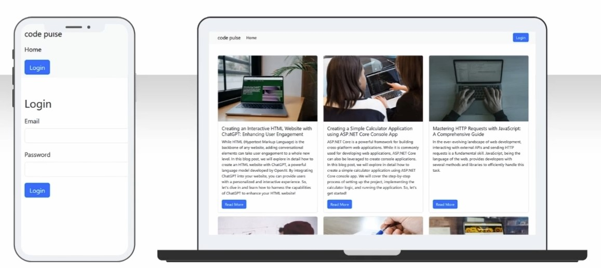

# codePulse

## Overview

`codePulse` is a full-stack web application tailored for blog management, demonstrating features such as authentication, authorization, live markdown previews, and full CRUD capabilities. The frontend is developed with Angular, providing a rich, single-page application experience, while the backend is an ASP.NET Core Web API, offering a solid RESTful service.
<br />


## Repository Structure

- `UI/codepulse`: Contains the Angular application for the frontend.
- `codePulse.API`: Houses the ASP.NET Core Web API for backend services.
- `codePulse.API.sln`: The solution file for the .NET Core API project.

## Technologies Used

- **Angular**: Frontend framework used for creating a single-page application.
- **ASP.NET Core Web API**: Backend framework used for creating RESTful APIs.
- **Entity Framework Core**: ORM used for data access from a SQL Server database.
- **JWT Tokens**: For handling authentication and authorization.
- **Bootstrap CSS**: For styling the Angular components.
- **Swagger**: For API documentation and testing.
- **Postman**: Recommended for testing API endpoints.

## Features

- **User Authentication and Authorization**: Secure login and access control using JWT tokens.
- **CRUD Operations**: Create, read, update, and delete blog posts and categories.
- **Image Upload**: Allows users to upload images both in the Angular application and via the ASP.NET Core Web API.
- **Markdown Preview**: Live preview of markdown text as HTML in the blog posts.
- **Role-Based Authorization**: Different access levels based on user roles.

## Getting Started

### Prerequisites

- Node.js and Angular CLI for the Angular application.
- .NET Core SDK for the ASP.NET Core API.
- SQL Server for the database backend.
- An understanding of HTML, CSS, TypeScript, and C#.

### Installation

To get started with CodePulse, follow these steps:
```bash
# Clone the repository
git clone https://github.com/Adnan25z/CodePulse.git

# Set up the UI application
cd CodePulse/UI/codepulse
npm install
ng serve --open
# The Angular frontend can now be accessed at http://localhost:4200/.

# Set up the API application
dotnet restore
dotnet run
# The API will be available as specified in its launch settings, typically http://localhost:<port>/.
```

## Usage

### Angular Application

- Navigate to http://localhost:4200/ to view and manage the blog.
- Utilize Angular forms to submit and manage blog posts.
- Use the live markdown preview to see changes as you create or edit posts.
- Upload images to be included in blog posts.
  
### ASP.NET Core Web API 

The backend API supports:
- RESTful endpoints for managing blog posts and categories.
- Authentication and authorization mechanisms.
- Image upload handling.
- Integration with Entity Framework Core for database operations.

## Testing

### Frontend Testing

Run unit tests in the Angular application with the following command:
```bash
ng test
```

### Backend Testing
Utilize Swagger by navigating to http://localhost:[port]/swagger to test the API endpoints manually or automate tests using Postman.
